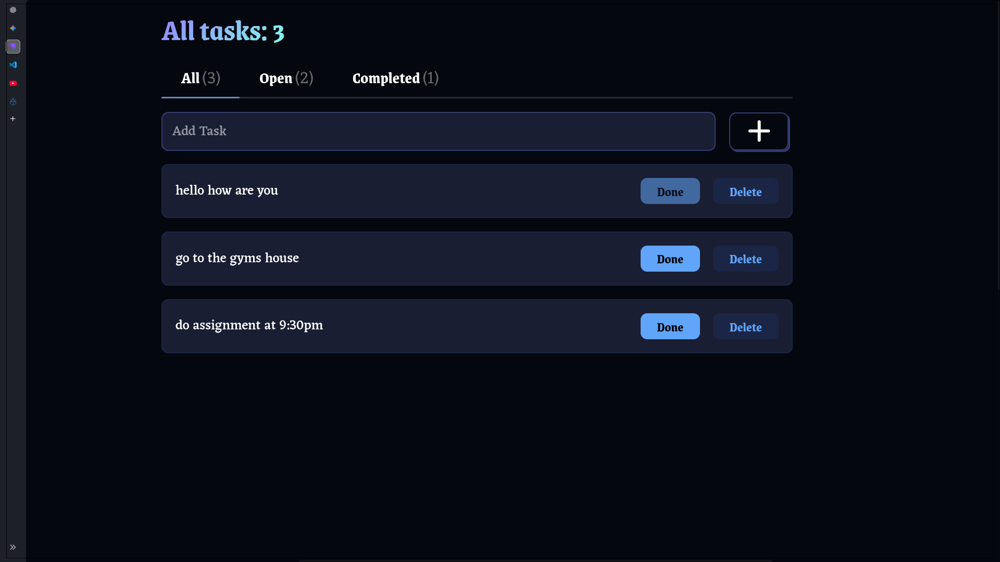
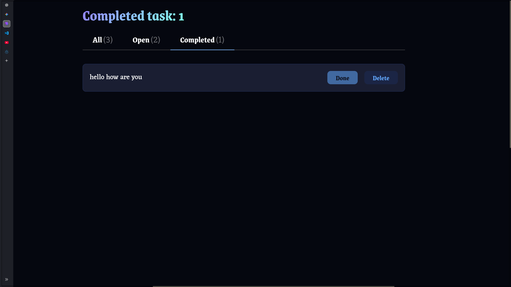

# React Todo App

A modern and responsive Todo application built with **React** and **Vite**. This project allows users to create, organize, complete, and delete tasks while automatically saving them using the browser's Local Storage.

---

## 🚀 Live Demo

**Live Site:** *Coming Soon*

---

## 📸 Screenshots

### All Tasks



### Open Tasks


### Completed Tasks



---

## ✨ Features

* ✅ Add new tasks
* ✅ Mark tasks as completed
* ✅ Delete tasks
* ✅ Filter tasks by:

  * All
  * Open
  * Completed
* ✅ Automatically save tasks using Local Storage
* ✅ Tasks persist after refreshing the browser
* ✅ Dynamic task counter
* ✅ Friendly empty-state messages
* ✅ Responsive user interface

---

## 🛠️ Built With

* React
* Vite
* JavaScript (ES6+)
* HTML5
* CSS3
* Local Storage API

---

## 📂 Project Structure

```text
src/
├── components/
│   ├── Header.jsx
│   ├── Tabs.jsx
│   ├── TodoInput.jsx
│   ├── TodoList.jsx
│   └── TodoCard.jsx
│
├── utils/
│   └── todoLocalStorage.js
│
├── App.jsx
├── main.jsx
└── index.css

screenshots/
├── all-tasks.png
├── open-tasks.png
└── completed-tasks.png
```

---

## 📚 What I Learned

Building this project helped me gain hands-on experience with:

* React Components
* Props
* State management with `useState`
* Side effects using `useEffect`
* Conditional rendering
* Event handling
* Rendering lists with `map()`
* Filtering data with `filter()`
* Persisting application data using Local Storage
* Creating reusable utility functions
* Improving UI/UX through thoughtful design decisions

---

## 💡 Improvements Beyond the Tutorial

To make the project more user-friendly, I implemented several enhancements beyond the tutorial:

* Improved the header with context-aware messages.
* Added friendly empty-state messages.
* Improved singular and plural task handling.
* Separated Local Storage logic into reusable utility functions.
* Customized parts of the user interface for a better user experience.

---

## ⚙️ Installation

Clone the repository:

```bash
git clone https://github.com/your-username/react-todo-app.git
```

Navigate into the project folder:

```bash
cd react-todo-app
```

Install dependencies:

```bash
npm install
```

Start the development server:

```bash
npm run dev
```

---

## 🔮 Future Improvements

* Edit existing tasks
* Search tasks
* Due dates
* Task categories
* Drag and drop task ordering
* Dark mode
* Animations

---

## 📄 License

This project was created for learning and portfolio purposes.
